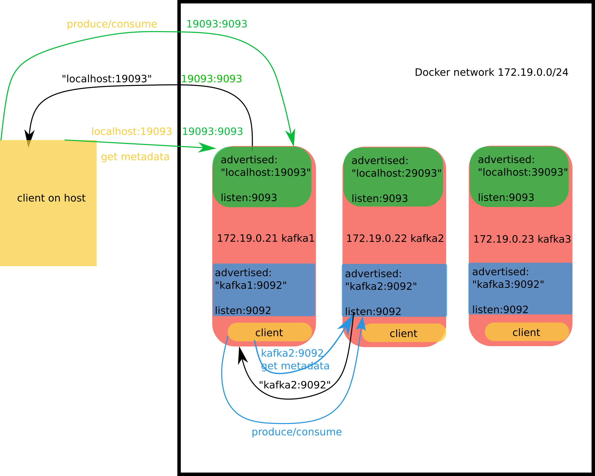

## ENV

bitnami/kafka 3.1.1

Docker version 19.03.5, build 633a0ea838

jdk 14.0.2

Fedora 29 x86_64 workstation

## zookeeper setting

see [zookeeper cluster in docker](https://github.com/ppdouble/zookeeper-cluster-docker#readme)

```text
      - KAFKA_CFG_ZOOKEEPER_CONNECT=zoo1:2181,zoo2:2181,zoo3:2181
```

## listener setting

```text
      - KAFKA_CFG_LISTENER_SECURITY_PROTOCOL_MAP=BROKERCLIENT:PLAINTEXT,HOSTCLIENT:PLAINTEXT
      - KAFKA_CFG_LISTENERS=BROKERCLIENT://0.0.0.0:9092,HOSTCLIENT://0.0.0.0:9093
      - KAFKA_CFG_ADVERTISED_LISTENERS=BROKERCLIENT://kafka1:9092,HOSTCLIENT://localhost:19093
      - KAFKA_CFG_INTER_BROKER_LISTENER_NAME=BROKERCLIENT
```



- connections among borkers

1. initial connect, e.g. kafka2:9092
2. kafka2 response with metadata. "kafka2:9092" should be used for client to `produce` operation or `consume` operation
3. The client connects the broker for `produce` operation or `consume` operation etc. 

- connections among borkers and host

1. initial connect, e.g. localhost:19093
2. kafka1 response with metadata. "localhost:19093" should be used for the client on host to `produce` operation or `consume` operation
3. The client on host connects the broker for `produce` operation or `consume` operation etc.

## Client

```text
[hostuser@host-machine kafka$]docker exec --interactive --tty kafka-cluster-3 bash
I have no name!@kafka3:/opt/bitnami/kafka$ bin/kafka-console-producer.sh --broker-list kafka3:9092 --topic test
>first event
>second event
>
```

```
[hostuser@host-machine kafka$]docker exec --interactive --tty kafka-cluster-1 bash
I have no name!@kafka1:/opt/bitnami/kafka$ bin/kafka-console-consumer.sh --bootstrap-server kafka1:9092 --topic test --from-beginning
first event
second event
```

```text
[hostuser@host-machine kafka$]bin/kafka-console-consumer.sh --bootstrap-server localhost:29093 --topic test --from-beginning
first event
second event
```

more see scripts in this project

## Java Api

see code in this project
